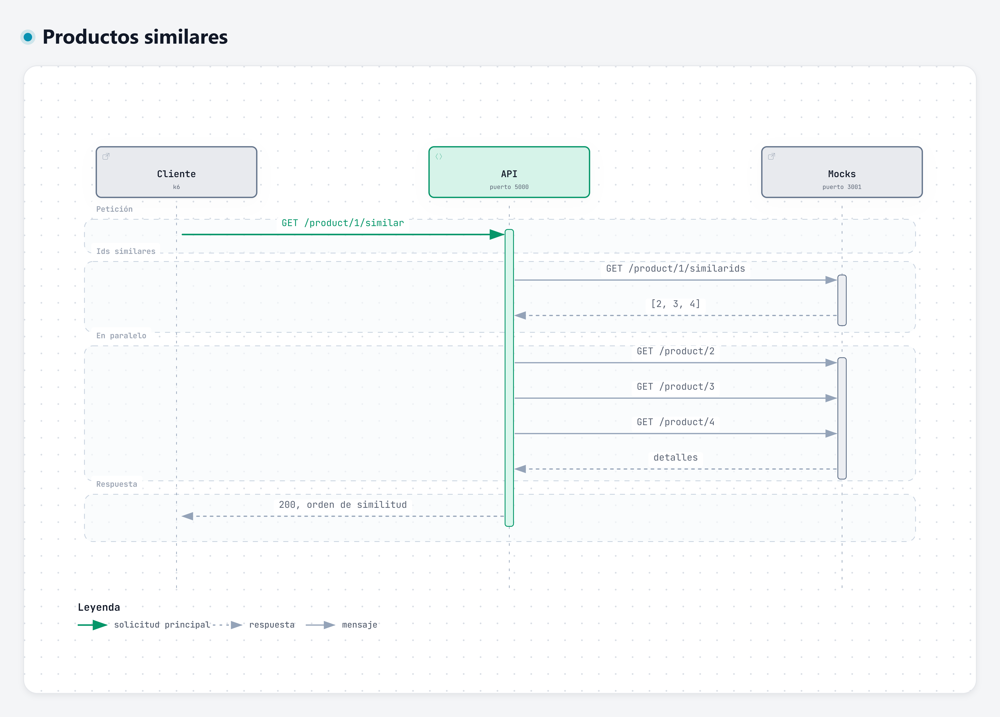
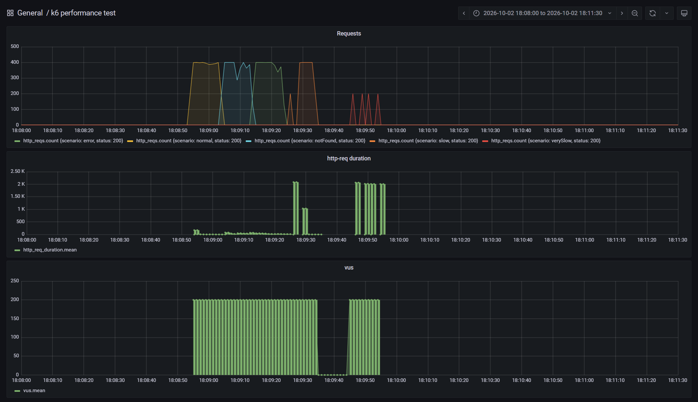

# AMS Solutions - Prueba técnica backend Java

API REST en Spring Boot que devuelve el detalle de los productos similares a uno dado. El enunciado está en [docs/prueba-tecnica.md](docs/prueba-tecnica.md).

## Versiones

- La solución está desarrollada con Java 25 y Spring Boot 4.1, y se construye con Maven a través del Maven Wrapper (`mvnw`), así que no hace falta tener Maven instalado.

Elegí Java 25 porque es la versión LTS actual y la aplicación usa virtual threads. Desde Java 24 un virtual thread que se bloquea dentro de un bloque `synchronized` ya no retiene el hilo real del sistema operativo (JEP 491), un matiz que en Java 21 obligaba a tener cuidado con algunas librerías.

## Cómo ejecutarlo

Hace falta Docker para los mocks, la infraestructura de evaluación y, si no hay JDK, también para la aplicación. Con un JDK 25 se puede arrancar sin construir la imagen.

Levantar los mocks y la infraestructura de evaluación:

```bash
docker-compose up -d simulado influxdb grafana
```

Levantar la aplicación, que escucha en el puerto 5000. Para desarrollar, con el JDK:

```bash
./mvnw spring-boot:run
```

Para evaluar, solo con Docker. La imagen se construye dentro del contenedor, así que en ese equipo no hace falta instalar Java ni Maven:

```bash
docker build -t similar-products .
docker run --rm -p 5000:5000 --add-host=host.docker.internal:host-gateway similar-products
```

k6 llama a `http://host.docker.internal:5000`, fijo en `shared/k6/test.js`, y ese fichero no se puede cambiar. Publicar el puerto 5000 deja la aplicación en esa URL. No la he metido en `docker-compose.yaml`: dentro de esa red k6 dejaría de alcanzarla en `host.docker.internal` y habría que tocar sus URLs. Desde el contenedor, `localhost:3001` no son los mocks del PC, así que la imagen usa `host.docker.internal:3001`.

Ejecutar el test de carga en otro terminal:

```bash
docker-compose run --rm k6 run scripts/test.js
```

Los resultados se ven en [Grafana](http://localhost:3000/d/Le2Ku9NMk/k6-performance-test).

### Tests

Los tests se lanzan con:

```bash
./mvnw test
```

No necesitan los mocks levantados. Cada pieza se prueba aislando la que tiene por debajo:

- `ProductClientTest` prueba el cliente contra un servidor HTTP real que levanta WireMock en un puerto libre, con las mismas respuestas que `shared/simulado/mocks.json`, incluidos 404, 500 y retrasos para los timeouts. También comprueba que un producto lento acaba guardado y la siguiente llamada es rápida.
- `SimilarProductsServiceTest` prueba el servicio sustituyendo el cliente por un mock de Mockito, que puede tardar lo que se le indique en responder. Así se comprueba el orden, el paralelismo y que un detalle que falla se omite.
- `SimilarProductsControllerTest` prueba solo la capa web con `@WebMvcTest` y `MockMvc`: la ruta, el JSON de la respuesta y los códigos 200, 404, 502 y 504.
- `SimilarProductsApplicationTests` arranca la aplicación entera, comprueba que `/actuator/health` responde `UP` y falla si algún bean no se puede crear.

### Integración continua

`.github/workflows/ci.yml` se ejecuta en cada pull request y en cada push a `main`. Lanza `./mvnw verify` con Java 25, que compila el proyecto y ejecuta los tests. El test de carga con k6 no forma parte de la pipeline: necesita los mocks, InfluxDB y Grafana levantados, y en los runners de GitHub los tiempos varían demasiado para que el resultado sea fiable. Se ejecuta en local con `docker-compose run --rm k6 run scripts/test.js`.

## Decisiones de diseño

### Cómo he abordado el problema

No había trabajado antes con concurrencia en Java y hacía tiempo que no programaba con Spring Boot, así que antes de escribir código quise entender qué se estaba evaluando de verdad. Leí el enunciado, los dos contratos, las respuestas de los mocks en `shared/simulado/mocks.json` y el test de carga en `shared/k6/test.js`, y de ahí salieron los números que han guiado el diseño:

- k6 lanza 200 usuarios virtuales concurrentes durante 10 segundos en cada uno de sus cinco escenarios.
- Los mocks responden con retrasos de 100 ms, 1 s, 5 s y 50 s según el producto, y algunos detalles devuelven 404 o 500.

La lógica funcional es casi trivial. Consiste en pedir los ids similares, pedir el detalle de cada uno y devolverlos en orden. Lo difícil es que la respuesta depende de llamadas lentas e imprevisibles que no controlo. Lo que sí puedo controlar es no esperar de más (paralelismo), no esperar para siempre (timeouts), no repetir trabajo (caché) y no dejar que un producto que falla tumbe la respuesta entera. A partir de ahí ordené el trabajo en hitos pequeños, cada uno con su pull request:

1. Preparar el proyecto, la CI y la documentación.
2. Exponer el endpoint con las llamadas de detalle en paralelo.
3. Hacerlo resiliente: timeouts y omitir los productos que fallan.
4. Añadir caché para no repetir llamadas lentas.
5. Validar con k6, documentar resultados y cerrar.

### Visión general



La versión explorable está en [docs/diagrams/similar-products-sequence.html](docs/diagrams/similar-products-sequence.html).

Si el producto principal no existe, los mocks responden 404 a `similarids` y la API devuelve 404. Si un producto similar falla o tarda demasiado, se omite y la API responde 200 con el resto.

### Estructura de carpetas

```text
src/main/java/com/amssolutions/similarproducts/
  SimilarProductsApplication.java      # punto de entrada
  product/
    SimilarProductsController.java     # GET /product/{productId}/similar; solo traduce HTTP
    SimilarProductsService.java        # orquesta: ids similares y detalles en paralelo, en orden
    ProductClient.java                 # cliente de las APIs existentes de los mocks
    ProductExceptionHandler.java       # traduce las excepciones del dominio a códigos HTTP
    ProductNotFoundException.java      # el producto no existe en los mocks
    ProductUpstreamException.java      # los mocks respondieron mal (502)
    ProductUpstreamTimeoutException.java  # los mocks no respondieron a tiempo (504)
    ProductDetail.java                 # detalle de producto, tal como lo define el contrato
    ProductConfig.java                 # beans: RestClient hacia los mocks y executor de virtual threads
    MocksProperties.java               # URL, timeouts y caché de los mocks, leídos de application.yml
```

He agrupado el código por dominio y no por capas técnicas, el mismo criterio que seguí en la prueba de Python. Todo lo relacionado con los productos vive junto en `product/`, de modo que para entender o cambiar la funcionalidad no hay que saltar entre carpetas.

Dentro del paquete sí he separado responsabilidades. El controller solo habla HTTP, el servicio decide qué pedir y en qué orden, y el cliente solo sabe hablar con los mocks. No he creado un subpaquete `exceptions/` ni capas dentro del paquete ya que con un solo caso de uso sería mover ficheros sin ganar claridad. Si el dominio creciera, el siguiente corte podría ser extraer un puerto (una interfaz del cliente) y dejar la implementación HTTP como adaptador.

### Modelo de concurrencia

El problema de fondo es que cada petición a la API espera a varias llamadas de red, algunas de hasta 50 segundos. Con el modelo clásico de Spring MVC, cada petición ocupa un hilo del sistema operativo mientras espera, y Tomcat trae 200 por defecto. Con 200 usuarios esperando a productos lentos, el pool se agota y las peticiones rápidas también hacen cola.

Investigando cómo resolverlo encontré dos caminos. Uno era Spring WebFlux, un modelo reactivo que no conocía y que obliga a programar de una forma muy distinta a la habitual. El otro eran los virtual threads, que permiten seguir escribiendo código normal y en el que cada petición espera en un hilo muy barato que gestiona Java, en lugar de ocupar un hilo del sistema operativo. Es similar a la solución de la prueba técnica con Python.

Elegí los virtual threads porque resuelven el problema sin cambiar la forma de programar, y el código queda fácil de leer y de explicar, que es lo primero que se evalúa.

### Llamadas en paralelo y orden

La primera versión del servicio pedía los detalles uno detrás de otro. Quise medirla antes de cambiarla, para tener una referencia. El producto 2, cuyos similares tardan 100 ms, 1 s y 5 s, respondía en 6,1 segundos, la suma de los tres. Al pedirlos a la vez bajó a 5,0 segundos, lo que tarda el más lento.

Para lanzarlos en paralelo uso `CompletableFuture`, que no conocía pero que es muy parecido a las promesas de JavaScript: representa un resultado que llegará más tarde, y `join()` hace el papel de `await`. El servicio sigue el mismo patrón que usaría en JavaScript para lanzar peticiones en paralelo.

Por eso recorre los ids dos veces. La primera lanza todas las peticiones y se queda con los futures. La segunda espera los resultados en el mismo orden que los ids, así que el orden de similitud se conserva aunque los detalles lleguen desordenados. Si lo hiciera todo en una sola pasada, sería como poner el `await` dentro de un bucle: cada petición esperaría a que terminara la anterior y volvería a ser secuencial. Hay un test que lo comprueba con detalles que tardan tiempos distintos.

La diferencia con JavaScript es que allí hay un solo hilo y `await` no bloquea nada, mientras que en Java `join()` bloquea de verdad el hilo que espera. Con hilos normales eso sería caro, pero con virtual threads bloquear un hilo es casi gratis, y por eso puedo escribir código que espera sin complicarlo.

Había otra opción más moderna, `StructuredTaskScope`, pero en Java 25 todavía es experimental y hay que activarla con opciones especiales al compilar y al ejecutar, así que preferí lo más estable y que mejor conocía.

El executor que crea los virtual threads lo crea Spring una sola vez al arrancar, y lo comparte toda la aplicación en lugar de crear uno por petición. Spring también se encarga de cerrarlo al parar la aplicación.

### Cliente de los mocks

`ProductClient` es un adaptador, la misma idea que el cliente del proveedor en la prueba de Python. Es la única pieza que sabe que los productos vienen de una API HTTP externa. El resto de la aplicación le pide "los ids similares" o "el detalle de un producto" sin saber de dónde salen. Si mañana esos datos vinieran de otro servicio o de una base de datos, solo cambiaría esta clase.

Por la misma razón, el cliente no deja escapar los errores HTTP tal cual. Los traduce a excepciones del dominio: `ProductNotFoundException` si el producto no existe, `ProductUpstreamException` si los mocks responden mal y `ProductUpstreamTimeoutException` si no responden a tiempo. El resto de la aplicación ve qué ha pasado, no el código HTTP. Qué hacer con ese error depende del contexto, y eso lo decide el servicio: si falla el producto principal, la API responde 404, 502 o 504; si falla un producto similar, se omite.

Para hacer las peticiones uso el cliente HTTP que ya trae Java, en lugar de añadir una librería. Prefiero no sumar dependencias si la plataforma ya ofrece lo necesario, y lo he dejado indicado de forma explícita en `ProductConfig` para que se vea qué se usa sin tener que deducirlo.

Los mocks devuelven los ids como números (`[2,3,4]`), aunque el contrato los define como texto. En lugar de fallar, el cliente los acepta y los convierte a texto. Es ser tolerante con lo que se recibe de otro sistema mientras se cumple estrictamente el contrato propio. Hay un test que lo comprueba con la misma respuesta que dan los mocks.

La URL y los timeouts de los mocks no están escritos en el código. Se leen de `application.yml` (`mocks.base-url`, por defecto `http://localhost:3001`, el servidor que declara `docs/contracts/existingApis.yaml`), porque cambian entre entornos y no tiene sentido recompilar para ajustarlos.

### Modelo de datos

`ProductDetail` es un `record` con los cuatro campos del contrato. Uso `BigDecimal` para el precio porque al tratarse de dinero, si usáramos `double` se guardarían los decimales de forma aproximada (0.1 + 0.2 = 0.30000000000000004). Para `availability` uso `boolean`, porque el contrato lo marca como obligatorio.

### Fallos parciales

La primera versión del endpoint fallaba entera si fallaba un solo similar. El producto 4 devolvía 404 porque uno de sus similares no existe, y el 5 devolvía 500 porque otro da error interno. k6 lo comprueba a propósito en los escenarios `notFound` y `error`.

Me pareció peor dejar al cliente sin ningún producto que devolverle una lista incompleta. Un similar que no se puede cargar no debería tumbar la página del que sí existe. Por eso el servicio pide cada detalle dentro de un `try/catch`: si falla, lo anota en el log y lo deja fuera. La respuesta sigue siendo 200, en el orden de similitud, con los que sí respondieron. Si fallan todos, la lista vacía `[]` es válida según el contrato.

El 404 del producto principal sigue siendo 404. Ese fallo no es parcial: no hay similares que mostrar si ni siquiera sabemos cuáles son.

No reintento los detalles que fallan. En los mocks los errores son fijos: el producto 6 siempre da 500. Reintentar sería repetir un fallo seguro y alargar la respuesta.

### Timeouts

Sin un tiempo máximo, una llamada al producto 10000 deja la petición 50 segundos esperando, y con 200 usuarios así k6 apenas obtiene respuestas. Medí esa línea base antes de poner el timeout ya que el escenario `verySlow` se quedó en 15 peticiones antes de implementarlo, la mayoría errores 500 porque al abrir tantas conexiones a la vez algunas fallaban.

| Propiedad                 | Valor por defecto | Por qué ese valor                                                                                                                                        |
| ------------------------- | ----------------- | -------------------------------------------------------------------------------------------------------------------------------------------------------- |
| `mocks.connect-timeout`   | `500ms`           | Si los mocks no aceptan la conexión, se nota enseguida. No hace falta esperar más.                                                                       |
| `mocks.read-timeout`      | `2s`              | Cuánto espera la API antes de responder. Entra el producto de 1 s y se omiten el de 5 s y el de 50 s.                                                    |
| `mocks.http-read-timeout` | `60s`             | Cuánto puede durar la llamada a los mocks. Más que los 2 s de espera, para que un producto lento pueda terminar y guardarse. Tiene que superar los 50 s. |

Los valores elegidos se basan en las pruebas realizadas. Elegí 2 s después de ver los retrasos de los mocks. Haber elegido 500 ms habría sido más rápido, pero también habría perdido el producto que tarda 1 s. 6 segundos habría incluido el de 5 s, pero era demasiada espera para una supuesta pantalla de producto. El coste que acepto es devolver menos productos a cambio de una latencia acotada.

Tras este cambio, k6 pasó de errores 404 y 500 en las pruebas de `notFound` y `error` a estado 200; y `slow` y `verySlow` bajaron de unos 6 s (o a colapsar) a unos 2,2 segundos. En `verySlow` hubo 4 respuestas de error 504 entre más de 800.

### Caché

He añadido Caffeine, una caché en memoria para los productos. Guarda el detalle de cada producto y la lista de ids similares. Si el mismo producto se pide otra vez mientras la primera llamada sigue en curso, no se vuelve a llamar a los mocks: las demás esperan esa llamada y, cuando termina, leen el valor guardado. En una tienda real la misma ficha se consulta muchas veces y los similares no cambian a cada segundo, así que no tiene sentido volver a pedirlos en cada visita. De esta forma se mejora el rendimiento, porque la siguiente visita no espera, y la resiliencia, porque muchas visitas a la vez comparten una sola llamada. Los productos que el timeout deja fuera entran en la siguiente respuesta: a los 2 segundos la API responde sin ellos, pero la llamada a los mocks no se corta y, si llegan, se guardan.

| Propiedad              | Valor por defecto | Por qué ese valor                                                                                                                 |
| ---------------------- | ----------------- | --------------------------------------------------------------------------------------------------------------------------------- |
| `mocks.cache-ttl`      | `1m`              | Cuánto tiempo se recuerda un producto. En los mocks no cambia nada, pero en un catálogo el precio sí. Un minuto es un compromiso. |
| `mocks.cache-max-size` | `1000`            | Tope de entradas para que la memoria no crezca sin límite. De sobra para los productos de esta prueba.                            |

Sin caché, en la prueba de k6 cada petición volvía a llamar a los mocks aunque la respuesta no hubiera cambiado. Con el tope de 2 s eso se notaba en los lentos. El producto 2 tiene tres similares: uno de 100 ms, uno de 1 s y **Coat**, que tarda 5 s. Lo pedí con la aplicación recién arrancada. La primera respuesta tardó 2,3 segundos y vino sin **Coat** (sólo **Blazer** y **Trousers**) porque esta tardaba más que el timeout configurado. La repetí unos segundos después y tardó 4 milisegundos, esta vez incluyendo el **Coat**.

### Errores y códigos HTTP

El servicio no sabe nada de HTTP. Lanza excepciones del dominio y `ProductExceptionHandler` (`@RestControllerAdvice`) las traduce en un único sitio. El controller se limita a llamar al servicio.

El contrato solo define 200 y 404. Los otros códigos son decisión mía, para distinguir un producto que no existe de un fallo detrás de la API:

- **404 NOT_FOUND** si el producto principal no existe.
- **502 BAD_GATEWAY** si `similarids` responde mal. El frontend hizo bien la petición; ha fallado el servicio del que dependo.
- **504 GATEWAY_TIMEOUT** si `similarids` no responde a tiempo.

El cuerpo es `ProblemDetail` (RFC 9457), el formato estándar de errores HTTP. Spring lo trae de serie: `status`, `title` y `detail`. El 404 también lo usa. El contrato no pide cuerpo en el 404, pero un JSON extra no rompe a quien solo mira el código.

### Observabilidad

Cuando un producto similar se omite, el servicio deja un `WARN` en el log con el id y el motivo. Con eso se ve qué se cayó de la respuesta.

Además he expuesto Actuator solo en `/actuator/health`. Dice si el proceso está vivo, que es lo que miraría un balanceador. No he abierto el resto de endpoints: beans, env o métricas no aportan nada en esta prueba y enseñan más de la cuenta. El cuerpo es solo el estado, `{"status":"UP"}`.

### Resultados del test de carga

Pasé k6 contra la aplicación en Docker, con 200 usuarios durante 10 segundos en cada escenario. Todas las respuestas fueron 200.

| Escenario  | Peticiones | Media  | p95    |
| ---------- | ---------- | ------ | ------ |
| `normal`   | 3933       | 15 ms  | 30 ms  |
| `notFound` | 3722       | 44 ms  | 156 ms |
| `error`    | 3816       | 28 ms  | 66 ms  |
| `slow`     | 2398       | 351 ms | 2,1 s  |
| `verySlow` | 799        | 2,0 s  | 2,1 s  |

En conjunto fueron 14679 peticiones. La media quedó en 190 ms y ninguna pasó de 2,1 s.



En la captura, `normal`, `notFound` y `error` van a ras de suelo. En `slow` se ve el pico de las primeras peticiones, que esperan a Coat, y luego baja. `verySlow` se queda en los 2 s: el producto de 50 s no cabe en los 10 s del escenario, así que no llega a guardarse.

### Limitaciones

La caché vive en la memoria de este proceso. Al reiniciar se vacía, y si hubiera varias instancias cada una tendría la suya.

No guardo los errores. El producto 6 siempre da 500, y guardarlo sería seguir devolviendo un fallo que ya no existe.

Caffeine escribe un aviso con traza cuando una carga falla. No cambia la respuesta. Es ruido en el log.

## Referencia

Este proyecto parte del enunciado y la infraestructura de evaluación de [dalogax/backendDevTest](https://github.com/dalogax/backendDevTest).
