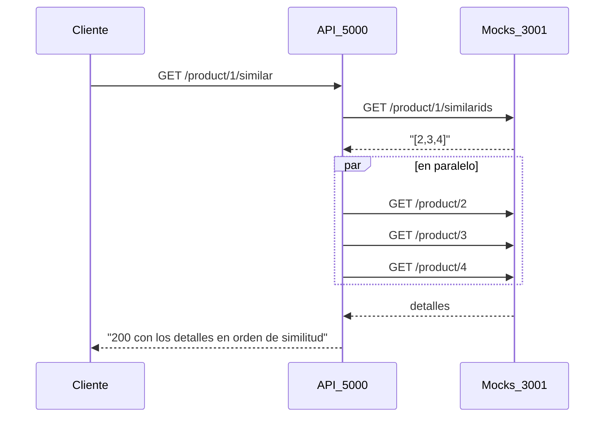

# AMS Solutions - Prueba técnica backend Java

API REST en Spring Boot que devuelve el detalle de los productos similares a uno dado. El enunciado está en [docs/prueba-tecnica.md](docs/prueba-tecnica.md).

## Versiones

- La solución está desarrollada con Java 25 y Spring Boot 4.1, y se construye con Maven a través del Maven Wrapper (`mvnw`), así que no hace falta tener Maven instalado.

Elegí Java 25 porque es la versión LTS actual y la aplicación usa virtual threads. Desde Java 24 un virtual thread que se bloquea dentro de un bloque `synchronized` ya no retiene el hilo real del sistema operativo (JEP 491), un matiz que en Java 21 obligaba a tener cuidado con algunas librerías.

## Cómo ejecutarlo

Es necesario tener instalado Docker para los mocks y la infraestructura de evaluación, y un JDK 25 para la aplicación.

Levantar los mocks y la infraestructura de evaluación:

```bash
docker-compose up -d simulado influxdb grafana
```

Levantar la aplicación, que escucha en el puerto 5000:

```bash
./mvnw spring-boot:run
```

Ejecutar el test de carga:

```bash
docker-compose run --rm k6 run scripts/test.js
```

Los resultados se ven en [Grafana](http://localhost:3000/d/Le2Ku9NMk/k6-performance-test).

### Tests

Los tests se lanzan con:

```bash
./mvnw test
```

No necesitan los mocks levantados. Cada pieza se prueba aislando la que tiene por debajo:

- `ProductClientTest` prueba el cliente contra un servidor HTTP real que levanta WireMock en un puerto libre, con las mismas respuestas que `shared/simulado/mocks.json`.
- `SimilarProductsServiceTest` prueba el servicio sustituyendo el cliente por un mock de Mockito, que puede tardar lo que se le indique en responder. Así se comprueba el orden y el paralelismo sin depender de la red.
- `SimilarProductsControllerTest` prueba solo la capa web con `@WebMvcTest` y `MockMvc`: la ruta, el JSON de la respuesta y los códigos HTTP.
- `SimilarProductsApplicationTests` arranca la aplicación entera y falla si algún bean no se puede crear.

### Integración continua

`.github/workflows/ci.yml` se ejecuta en cada pull request y en cada push a `main`. Lanza `./mvnw verify` con Java 25, que compila el proyecto y ejecuta los tests. El test de carga con k6 no forma parte de la pipeline: necesita los mocks, InfluxDB y Grafana levantados, y en los runners de GitHub los tiempos varían demasiado para que el resultado sea fiable. Se ejecuta en local con `docker-compose run --rm k6 run scripts/test.js`.

## Decisiones de diseño

### Cómo he abordado el problema

No había trabajado antes con concurrencia en Java y hacía tiempo que no programaba con Spring Boot, así que antes de escribir código quise entender qué se estaba evaluando de verdad. Leí el enunciado, los dos contratos, las respuestas de los mocks en `shared/simulado/mocks.json` y el test de carga en `shared/k6/test.js`, y de ahí salieron los números que han guiado el diseño:

- k6 lanza 200 usuarios virtuales concurrentes durante 10 segundos en cada uno de sus cinco escenarios.
- Los mocks responden con retrasos de 100 ms, 1 s, 5 s y 50 s según el producto, y algunos detalles devuelven 404 o 500.

La lógica funcional es casi trivial. Consiste en pedir los ids similares, pedir el detalle de cada uno y devolverlos en orden. Lo difícil es que la respuesta depende de llamadas lentas e imprevisibles que no controlo. Lo que sí puedo controlar es no esperar de más (paralelismo), no esperar para siempre (timeouts), no repetir trabajo (caché) y no dejar que un producto que falla tumbe la respuesta entera. A partir de ahí ordené el trabajo en hitos pequeños, cada uno con su pull request:

1. Preparar el proyecto, la CI y la documentación.
2. Exponer el endpoint con las llamadas de detalle en paralelo.
3. Hacerlo resiliente: timeouts y omitir los productos que fallan.
4. Añadir caché para no repetir llamadas lentas.
5. Validar con k6, documentar resultados y cerrar.

### Visión general



Si el producto principal no existe, los mocks responden 404 a `similarids` y la API devuelve 404.

### Estructura de carpetas

```text
src/main/java/com/amssolutions/similarproducts/
  SimilarProductsApplication.java      # punto de entrada
  product/
    SimilarProductsController.java     # GET /product/{productId}/similar; solo traduce HTTP
    SimilarProductsService.java        # orquesta: ids similares y detalles en paralelo, en orden
    ProductClient.java                 # cliente de las APIs existentes de los mocks
    ProductExceptionHandler.java       # traduce las excepciones del dominio a códigos HTTP
    ProductNotFoundException.java      # el producto no existe en los mocks
    ProductDetail.java                 # detalle de producto, tal como lo define el contrato
    ProductConfig.java                 # beans: RestClient hacia los mocks y executor de virtual threads
    MocksProperties.java               # URL de los mocks leída de application.yml
```

He agrupado el código por dominio y no por capas técnicas, el mismo criterio que seguí en la prueba de Python. Todo lo relacionado con los productos vive junto en `product/`, de modo que para entender o cambiar la funcionalidad no hay que saltar entre carpetas.

Dentro del paquete sí he separado responsabilidades. El controller solo habla HTTP, el servicio decide qué pedir y en qué orden, y el cliente solo sabe hablar con los mocks.

### Modelo de concurrencia

El problema de fondo es que cada petición a la API espera a varias llamadas de red, algunas de hasta 50 segundos. Con el modelo clásico de Spring MVC, cada petición ocupa un hilo del sistema operativo mientras espera, y Tomcat trae 200 por defecto. Con 200 usuarios esperando a productos lentos, el pool se agota y las peticiones rápidas también hacen cola.

Investigando cómo resolverlo encontré dos caminos. Uno era Spring WebFlux, un modelo reactivo que no conocía y que obliga a programar de una forma muy distinta a la habitual. El otro eran los virtual threads, que permiten seguir escribiendo código normal y en el que cada petición espera en un hilo muy barato que gestiona Java, en lugar de ocupar un hilo del sistema operativo. Es similar a la solución de la prueba técnica con Python.

Elegí los virtual threads porque resuelven el problema sin cambiar la forma de programar, y el código queda fácil de leer y de explicar, que es lo primero que se evalúa.

### Llamadas en paralelo y orden

La primera versión del servicio pedía los detalles uno detrás de otro. Quise medirla antes de cambiarla, para tener una referencia. El producto 2, cuyos similares tardan 100 ms, 1 s y 5 s, respondía en 6,1 segundos, la suma de los tres. Al pedirlos a la vez bajó a 5,0 segundos, lo que tarda el más lento.

Para lanzarlos en paralelo uso `CompletableFuture`, que no conocía pero que es muy parecido a las promesas de JavaScript: representa un resultado que llegará más tarde, y `join()` hace el papel de `await`. El servicio sigue el mismo patrón que usaría en JavaScript para lanzar peticiones en paralelo.

Por eso recorre los ids dos veces. La primera lanza todas las peticiones y se queda con los futures. La segunda espera los resultados en el mismo orden que los ids, así que el orden de similitud se conserva aunque los detalles lleguen desordenados. Si lo hiciera todo en una sola pasada, sería como poner el `await` dentro de un bucle: cada petición esperaría a que terminara la anterior y volvería a ser secuencial. Hay un test que lo comprueba con detalles que tardan tiempos distintos.

La diferencia con JavaScript es que allí hay un solo hilo y `await` no bloquea nada, mientras que en Java `join()` bloquea de verdad el hilo que espera. Con hilos normales eso sería caro, pero con virtual threads bloquear un hilo es casi gratis, y por eso puedo escribir código que espera sin complicarlo.

Había otra opción más moderna, `StructuredTaskScope`, pero en Java 25 todavía es experimental y hay que activarla con opciones especiales al compilar y al ejecutar, así que preferí lo más estable y que mejor conocía.

El executor que crea los virtual threads lo crea Spring una sola vez al arrancar, y lo comparte toda la aplicación en lugar de crear uno por petición. Spring también se encarga de cerrarlo al parar la aplicación.

### Cliente de los mocks

`ProductClient` es un adaptador, la misma idea que el cliente del proveedor en la prueba de Python. Es la única pieza que sabe que los productos vienen de una API HTTP externa. El resto de la aplicación le pide "los ids similares" o "el detalle de un producto" sin saber de dónde salen. Si mañana esos datos vinieran de otro servicio o de una base de datos, solo cambiaría esta clase.

Por la misma razón, el cliente no deja escapar los errores HTTP tal cual. Cuando los mocks responden 404, lo traduce a `ProductNotFoundException`, una excepción del dominio que dice qué ha pasado ("ese producto no existe") y no cómo se ha enterado. Además, el cliente no decide qué hacer con ese error, porque depende del contexto. Si no existe el producto principal, la API debe responder 404 y si no existe un producto similar, basta con omitirlo. Esa decisión es del servicio, que es quien conoce el contexto.

Para hacer las peticiones uso el cliente HTTP que ya trae Java, en lugar de añadir una librería. Prefiero no sumar dependencias si la plataforma ya ofrece lo necesario, y lo he dejado indicado de forma explícita en `ProductConfig` para que se vea qué se usa sin tener que deducirlo.

Los mocks devuelven los ids como números (`[2,3,4]`), aunque el contrato los define como texto. En lugar de fallar, el cliente los acepta y los convierte a texto. Es ser tolerante con lo que se recibe de otro sistema mientras se cumple estrictamente el contrato propio. Hay un test que lo comprueba con la misma respuesta que dan los mocks.

La URL de los mocks no está escrita en el código. Se lee de `application.yml` (`mocks.base-url`, por defecto `http://localhost:3001`, el servidor que declara `docs/existingApis.yaml`), porque cambia entre entornos y no tiene sentido recompilar para apuntar a otro sitio.

### Modelo de datos

`ProductDetail` es un `record` con los cuatro campos del contrato. Uso `BigDecimal` para el precio porque al tratarse de dinero, si usáramos `double` se guardarían los decimales de forma aproximada (0.1 + 0.2 = 0.30000000000000004). Para `availability` uso `boolean`, porque el contrato lo marca como obligatorio.

### Errores y códigos HTTP

El servicio no sabe nada de HTTP. Cuando el producto principal no existe, la excepción del dominio sube hasta `ProductExceptionHandler`, un `@RestControllerAdvice` que la traduce a 404 en un único sitio. Así el controller se limita a llamar al servicio, y los códigos de error que lleguen más adelante tendrán su sitio sin tocar el endpoint.

## Referencia

Este proyecto parte del enunciado y la infraestructura de evaluación de [dalogax/backendDevTest](https://github.com/dalogax/backendDevTest).
